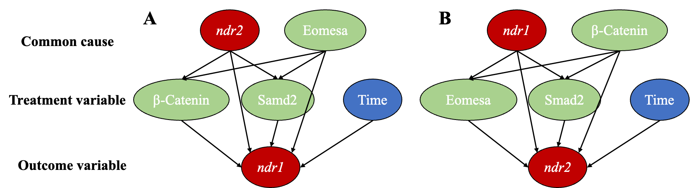

# Regulatory factors identification for nodal genes in zebrafish by causal inference

This repository contains the scripts to reproduce the result of the manuscript [*Regulatory factors identification for nodal genes in zebrafish by causal inference*](https://www.frontiersin.org/articles/10.3389/fcell.2022.1047363/abstract )

## Abstract

Activation of nodal genes is critical for mesoderm and endoderm induction. Our previous study reported that the zebrafish nodal genes ndr1/squint and ndr2/cyclops are coordinately regulated by maternal Eomesa, Hwa-activated β-catenin (Hwa/β-catenin) signaling, and Nodal autoregulation (Nodal/Smad2) signaling. However, the exact contribution and underlying mechanisms are still elusive. Here we applied “causal inference” to evaluate the causal between the independent and dependent variables, and found that Hwa/β-catenin and Smad2 are the cause of ndr1 activation, while Eomesa is the cause of ndr2 activation. Mechanistically, the different cis-regulatory regions of ndr1 and ndr2 bound by Eomesa, β-catenin, and Smad2 were screened out via ChIP-qPCR and verified by the transgene constructs. The marginal GFP expression driven by ndr1 transgenesis could be diminished without both maternal Eomesa and Hwa/-catenin. While Eomesa, not β-catenin, could bind and activate ndr2 demonstrated by ndr2 transgenesis. Thus, the distinct regulation of ndr1/ndr2 relies on different cis-regulatory regions.

## Casual inference

## Content

- `/data/`: the raw data to reproduce the figures
- `/result/`: the analysis result and figure of the manuscript
- `ols and casual inference.ipynb`: the raw code to reproduce the ols and casual inference analysis
- `ols and plot.ipynb`: the raw code to reproduce the ols figure in each time point

## Contact

- Zehua Zeng (starlitnightly@163.com)